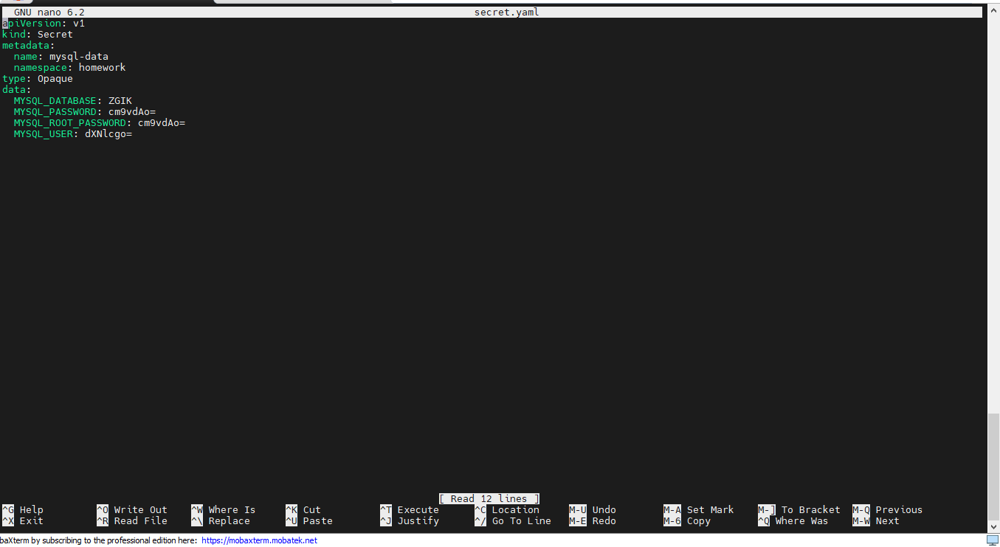
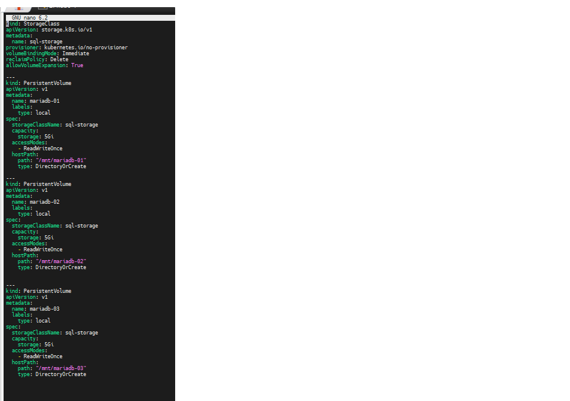
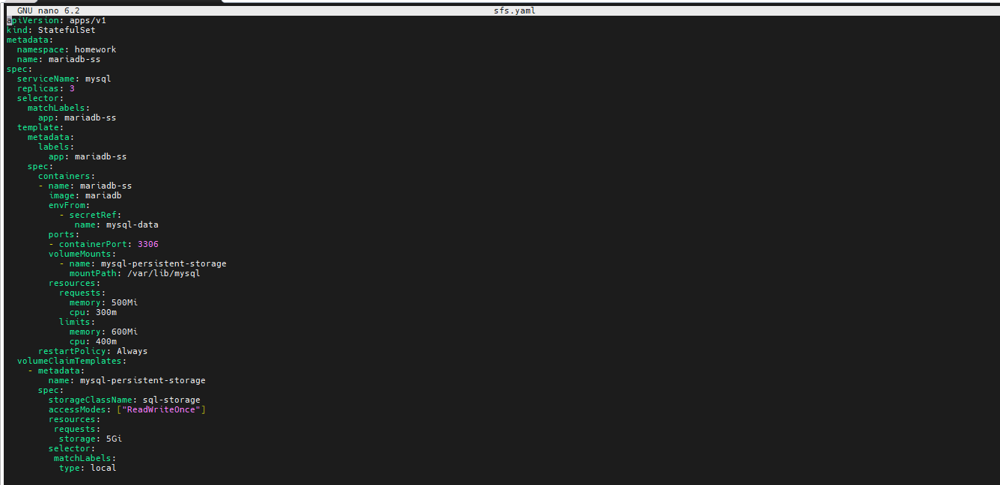
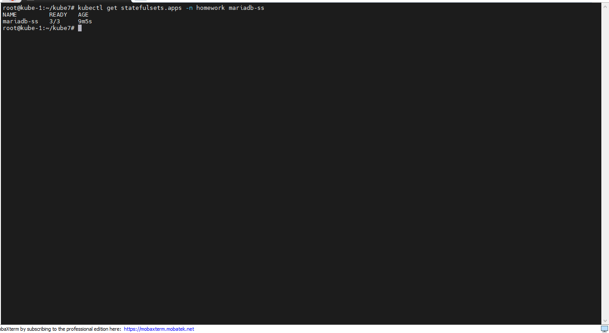
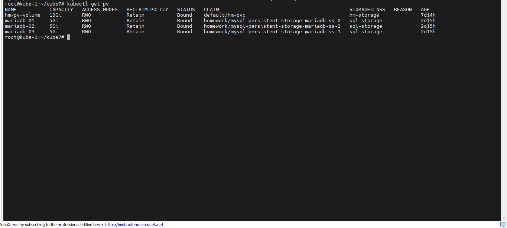
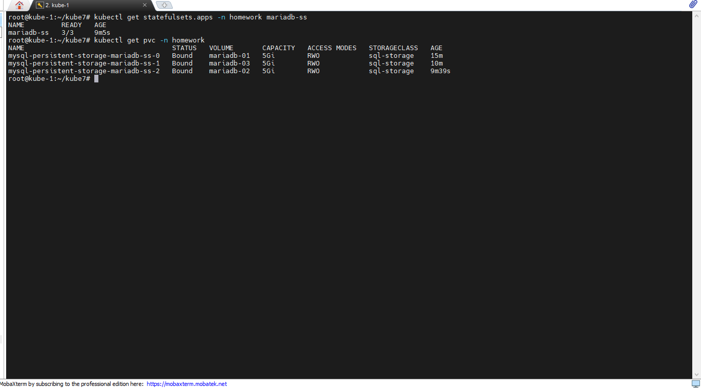

# Закрепить навыки, полученные на лекции и семинаре. Выбрать любую другую БД и запустить с ее помощью StatefulSet с подключением внешних хранилищ. Убедиться, что все работает.

## 1. Первым шагом создадим новое пространство имен, командой **kubectl create namespace homework**, будем деплоить все сущности в этом пространстве имен.
## 2. Создадим secret для нашей БД.

## 3. Далее напишем манифесты для SC, PV, PVC.

## 4. Теперь необходимо написать манифест для нашей СУБД и запустить ее.

## - проверим что СУБД поднялась, командой **kubectl get statefulsets.apps -n homework mariadb-ss**

## - проверим pv

## - также проверим pvc
